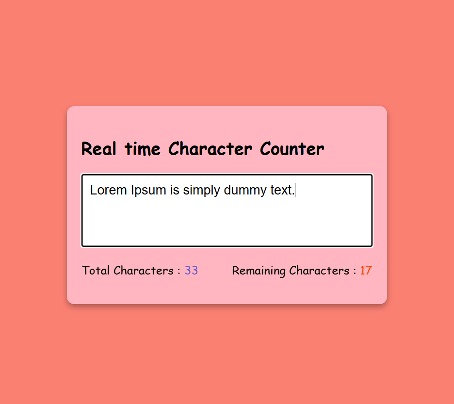

## ✏️ Real-Time Character Counter

A simple yet effective **real-time character counter** web application built using **HTML**, **CSS**, and **JavaScript**. This tool is perfect for writers, students, and anyone needing to monitor text limits while typing.

---

## 🚀 Features  
- ✅ Real-time character count  
- ✅ Real-time word count  
- ✅ Responsive and minimalist UI  
- ✅ Lightweight and fast  
- ✅ Instant feedback without page reload  

---

## 🛠 Tech Stack  
- **HTML5**  
- **CSS3**  
- **JavaScript**

---

## 📷 Screenshots  
  

---

## 📥 Download & Installation  

Clone the repository using Git:  
```bash
git clone https://github.com/aklema094/Real-time-Character-Counter.git
```

Or download the ZIP file manually from [here](https://github.com/aklema094/Real-time-Character-Counter/archive/refs/heads/main.zip)


